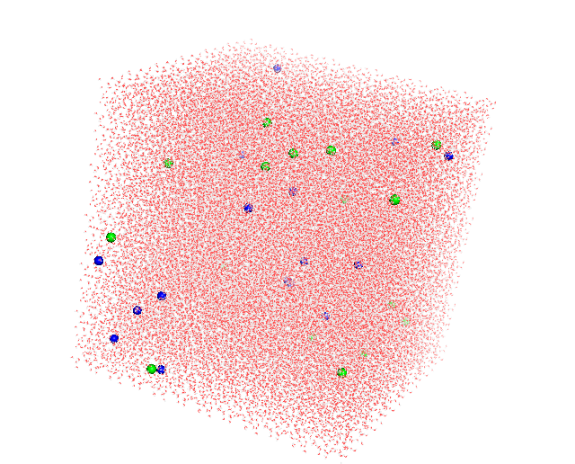
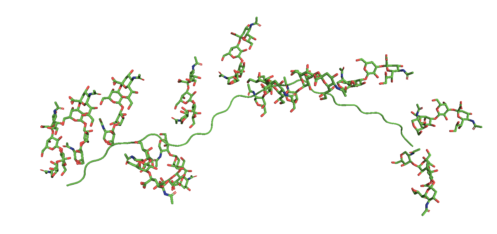

# Understanding MUC2

Ions have very important role in the organization and compaction of MUC2. 

## Sect A: Hydration around cations and anaions

To this end, we have simulated waterbox with NaCl and CaCl2 at different salt concentrations (0.02, 0.04, 0.06, 0.08, 0.10 and 0.12 M), and tried to get an estimate of the hydration shell of the Na+, Ca2+ and Cl- ions. The waterbox was a cubic box with edge length 11.2 n having the following number of ions in both the cases (shown in the Table A1). We performed 50 ns simulation in each case.

#### Table A1
| Concentration  (M) | #Na (NaCl) | #Cl (NaCl) | #Ca (CaCl2) | #Cl  (CaCl2)|
| ------------------ | ---------- | ---------- | ---------------------- | ---------------------- |
|         0.02       |      16    |     16     |          16            |           32           |
|         0.04       |      33    |     33     |          33            |           66           |
|         0.06       |      50    |     50     |          50            |          100           |
|         0.08       |      67    |     67     |          67            |          134           |
|         0.10       |      84    |     84     |          84            |          168           |
|         0.12       |     101    |    101     |         101            |          202           |

Here are some snapshots of the simulation box for better understanding.

    

        <h2>NaCl conc 0.02 M</h2>
        
    

    

        <h2>CaCl2 conc 0.120 M</h2>
        
    

When we plotted the radial distribution of water oxygens around Na and water hydrogens around Cl, the curves superposed upon each other for different concentrations. Similar trend was observed for CaCl2 as well. However, we figured out the radius of the hydration shell of Na, Ca and Cl ions and used this information in modelling the interaction of negatively charged sugars with cations.

### Radial distribution of water molecule around Na and Cl ions in NaCl solutions

 The first maxima for sodium hydration appears at 0.235 nm and the first minima appears at 0.320 nm, the cumulative coordination number is 2 and 6 at this maxima and minima respectively.

 

 The first maxima for chlorine hydration appears at 0.225 nm and the first minima appears at 0.290 nm, the cumulative coordination number is 2 and 4 at this maxima and minima respectively.

### Radial distribution of water molecule around Ca and Cl ions in CaCl2 solutions

The first maxima for sodium hydration appears at 0.230 nm and the first minima appears at 0.330 nm, the cumulative coordination number is 2.5 and 7.5 at this maxima and minima respectively.

The chlorine hydration shell is same as obtained in the simulation with NaCl, as expected.

## Sect B: Interaction of cations with negatively charged sugars

Mucin has huge disordered region rich in Threonine, Serine and Proline, called the PTS region. Here most of the Serines and Threonines are glycosylated. In general, the 80% mass of mucin consists of sugars. Also, most of the sugars are negatively charged (either they are sialyted or suphated). To model the interaction of negatively charged sugars with Na and Ca ions, we took a short fragment of PTS region consisting of 30 amino acids. The sequence of which is:

TTTVTPTPTPTGTQTPTTTPITTTTTVTPT

We attached the sugar { DNeup5Aca2-3DGalpb1-4[DGalpb1-3DFucpa1-3]DGlcpNAcb1-3DGalpa1-3DGalpNAca1-OH} at 12 sites of this fragment using glycam webserver (https://glycam.org/), where we had to provide a PDB file. The 12 sugars out of 19 glycosylation sites effectively make a glycosylated fragment with 63% glycosylation. See the picture of the structure below for better understanding.

With this fragment, I prepared all the files using CHARMM-GUI web server (https://www.charmm-gui.org/), solvated the fragment in a cubic box with edge length 11.2 nm with TIP3P water molecules. All the paramenters for generating GROMACS input were taken from CHARMM36m force field. I generated input files for five different salt concentrations of NaCl and CaCl2 each, namely 0.02, 0.04, 0.06, 0.08, 0.10, 0.12 M. At different salt concentrations we performed all-atom simulations. Each box have the following number of ions including counterions, see the table below,

#### Table B1
| Concentration  (M) | #Na (NaCl) | #Cl (NaCl) | #Ca (CaCl2) | #Cl  (CaCl2)|
| ------------------ | ---------- | ---------- | ---------------------- | ---------------------- |
|         0.02       |      28    |     16     |          22            |           32           |
|         0.04       |      45    |     33     |          39            |           66           |
|         0.06       |      61    |     49     |          55            |           98           |
|         0.08       |      78    |     66     |          72            |          132           |
|         0.10       |      94    |     82     |          88            |          164           |
|         0.12       |     111    |     99     |         105            |          198           |

Here is one example image how the PTS fragment with 0.120 M CaCl2 salt concentration look like.

We plotted the radial distribution of cations around charged sugar residues

