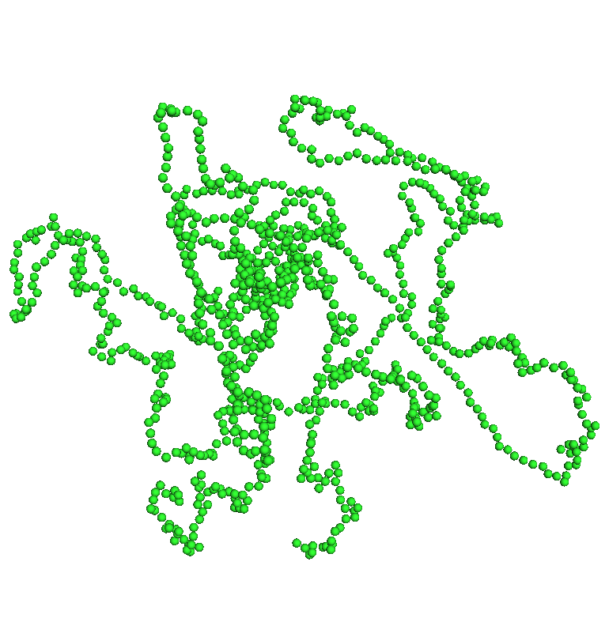
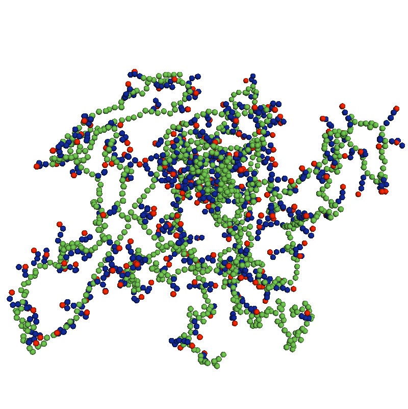
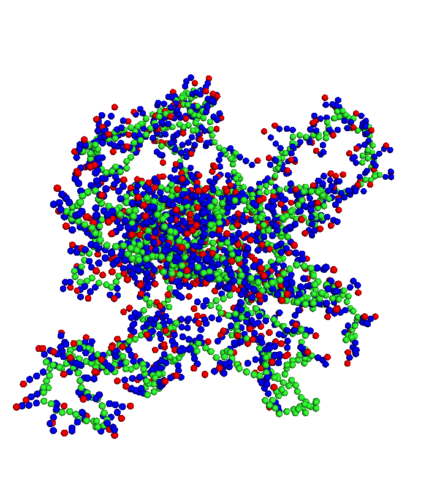
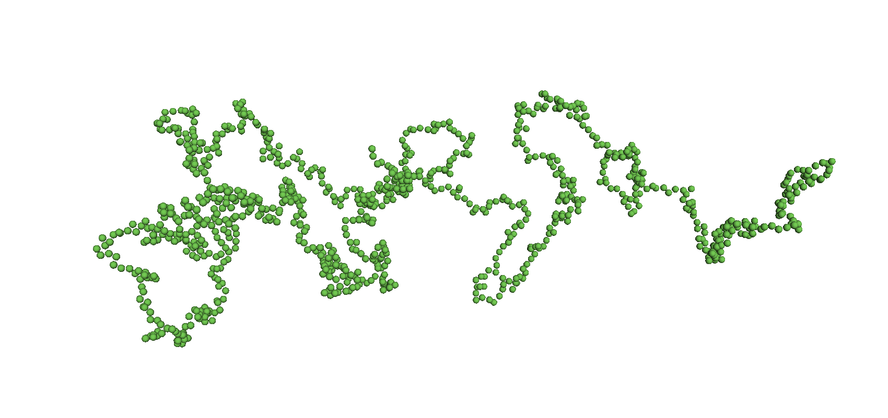
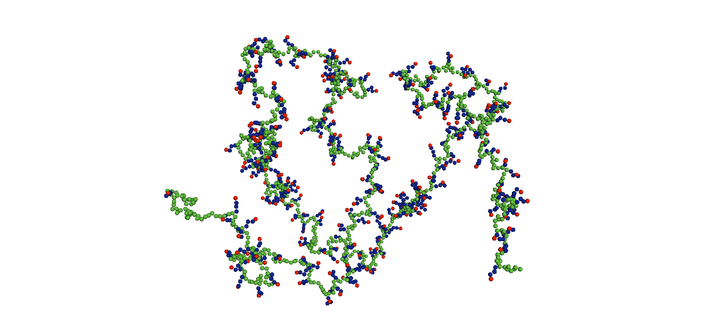
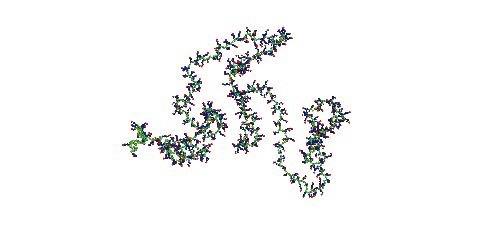
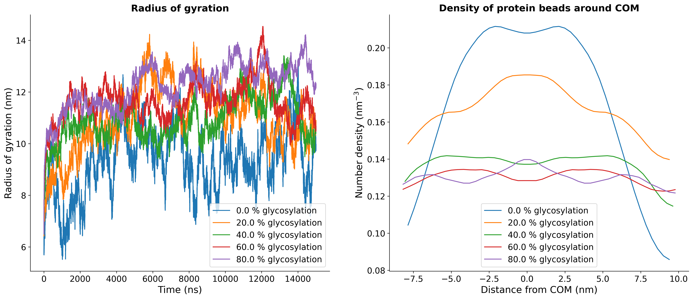
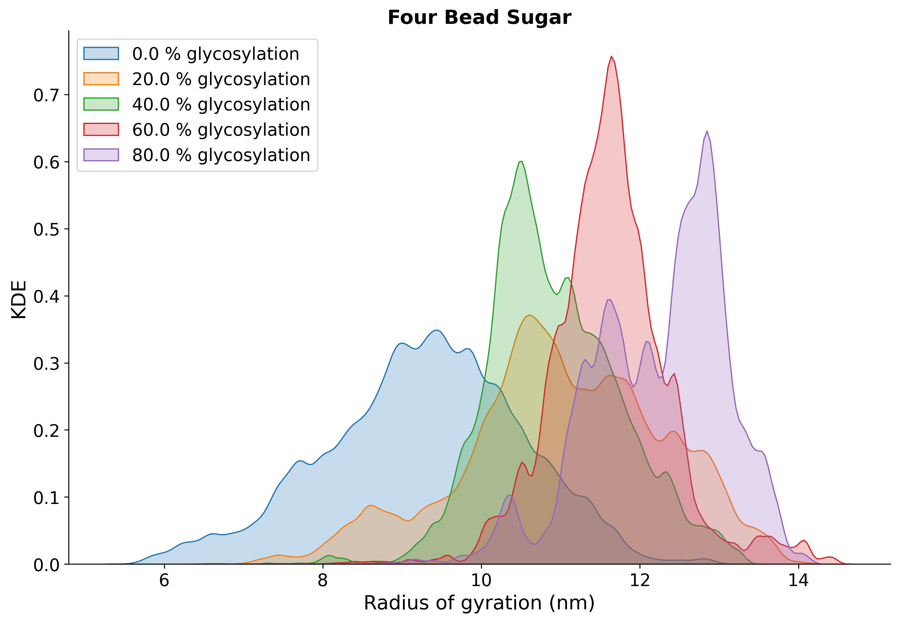

# Effect of sugar length and number of sugars in PTS dynamics

Initially, we took a 1000 amino acid long fragment of the PTS region. Here we represented each of the amino acids with a single bead centered at its C&alpha; atom. Now, we added sugars to it using our own code, and make the structure as compact as possible by applying pulling. After pulling we tried to add more sugars, and added more sugars to it. Then I removed some sugars from the structure and appropriately modified the itp file to get difffferent degrees of glycosylation.

Initially each of the sugar chains were represented as four-bead chains, and the end bead has a negative charge.

## Effect of degree of glycosylation

### __Starting structures__

the initial structure with which the simulation was started are as follows:

    

        <h2>0% glycosylation</h2>
        
    

    

        <h2>40% glycosylation</h2>
        
    

    

        <h2>80% glycosylation</h2>
        
    

### __End structures__

As the simulations progressed in all of the cases we see the structures become more expanded as follows,

    

        <h2>0% glycosylation</h2>
        
    

    

        <h2>40% glycosylation</h2>
        
    

    

        <h2>80% glycosylation</h2>
        
    

### __Radius of gyration and density of protein beads__

It seems the radius of gyration increases with the increasing degree of glycosylation. There are two things we need to consider. One is mass of the glycans make the PTS chain heavier, thus is fluctuates less as the number of sugars increases. At the same time, as the number of sugars increases, there are more electrostatics repulsions which make the chains to go away from each other.

### __Distribution of the radius of gyration__

The distribution of the radius of gyration is as follows, it seems to be shifted towards the higher side and the general trend is the more degree of glycosylation the distribution is narrower. 

